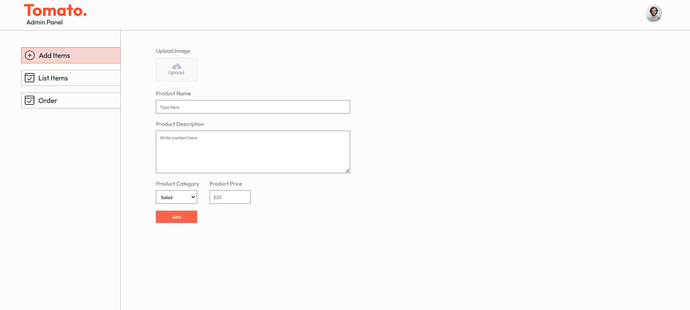
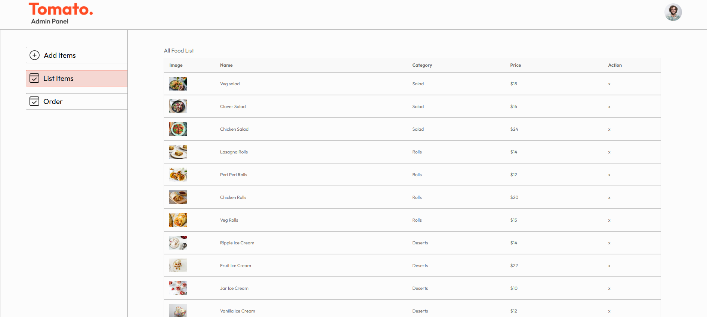
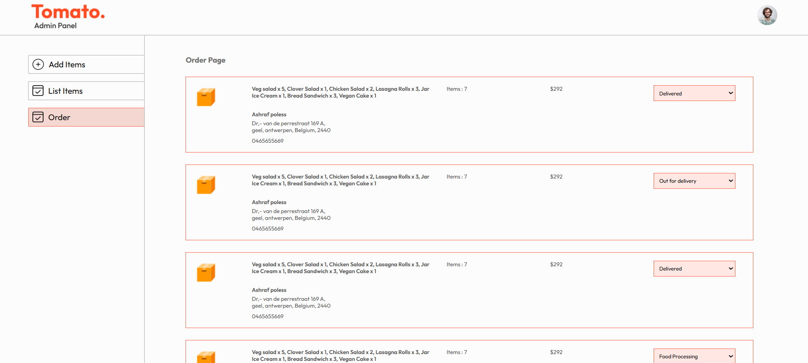

# Food Delivery Website - Admin Panel

## Contents

- [Food Delivery Website - Admin Panel](#food-delivery-website---admin-panel)
  - [Contents](#contents)
  - [Overview](#overview)
  - [Features](#features)
  - [Tech Stack](#tech-stack)
  - [Roadmap](#roadmap)
    - [Phase 1: UI Development](#phase-1-ui-development)
    - [Phase 2: API Integration](#phase-2-api-integration)
    - [Phase 3: Advanced Features](#phase-3-advanced-features)
    - [Phase 4: Optimization \& Deployment](#phase-4-optimization--deployment)
  - [Screenshots](#screenshots)
  - [NPM Libraries Used](#npm-libraries-used)
  - [API Usage Example](#api-usage-example)
  - [Connect With Me](#connect-with-me)

## Overview

- The Admin Panel allows administrators to manage products, orders, and users efficiently. Built using React.js, it provides an easy dashboard for overseeing the food delivery service.

## Features

- Admin Authentication: Secure login using JWT.

- Product Management: Add, update, and delete food items.

- Order Management: View and update order status.

- User Management: Manage customer accounts.

- Analytics Dashboard: View sales reports and performance metrics.

## Tech Stack

- Frontend Framework: React.js (Vite)

- Routing: React Router

- API Communication: Axios

- Authentication: JWT (via backend)

## Roadmap

### Phase 1: UI Development

- Create admin login page

- Develop dashboard UI with navigation

### Phase 2: API Integration

- Connect with backend APIs for product, order, and user management

- Implement authentication & role-based access control

### Phase 3: Advanced Features

- Add order tracking and filtering options

- Implement analytics for sales performance

### Phase 4: Optimization & Deployment

- Optimize performance

- Deploy using Vercel or Netlify

## Screenshots





## NPM Libraries Used

- react: Core library for building UI

- react-router-dom: Navigation and routing

- axios: API request handling

- react-toastify: Notifications and alerts

- chart.js: Analytics visualization

## API Usage Example

- Fetch All Orders
```
import axios from 'axios';
const API_URL = 'https://your-api.com/admin/orders';

const fetchOrders = async () => {
  try {
    const response = await axios.get(API_URL, {
      headers: { Authorization: `Bearer your_token` },
    });
    console.log(response.data);
  } catch (error) {
    console.error('Error fetching orders:', error);
  }
};

fetchOrders();
```

## Connect With Me

- [PORTFOLIO](ashrafpoless.vercel.app)
- [GITHUB](https://github.com/Ashrafpoless)
- [LINKEDIN](https://www.linkedin.com/in/ashraf-poless-034349317/)
